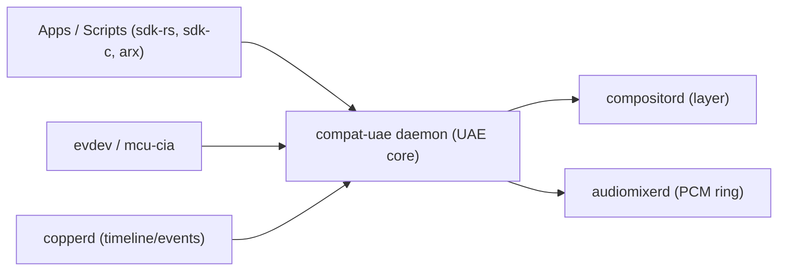

# compat-uae

**Classic Amiga compatibility for CopperlineOS (via UAE).**  
`compat-uae` packages a **headless UAE core** and wraps it in a CopperlineOS‑style daemon so classic Amiga software can run in a sandbox and integrate with Copperline services (display via `compositord`, timing via `copperd`, audio via `audiomixerd`, input via evdev/mcu‑cia).

> TL;DR: a UAE bridge that feels native—Amiga pixels become a Copperline layer, audio flows through `audiomixerd`, and scripts control it over a message port.

---

## Status

- **Phase‑0 MVP** (planned): OCS/ECS machines (A500/A1200), AGA later.  
- Display: **bitplane → RGBA** in software, uploaded to a compositor layer each frame.  
- Audio: 44.1/48 kHz PCM ring into `audiomixerd`.  
- Input: evdev keyboard/mouse; optional mcu‑cia gamepad/MIDI bridge.  
- Port protocol: JSON v0 (request/response + events).

> **ROMs are not provided.** You must supply legal Kickstart ROMs (see “ROMs & legal”).

License: bridge code **Apache‑2.0 OR MIT**; integrated UAE core is **GPL‑2.0+**. Distributing binaries that link UAE obligates GPL terms for the combined work.

---

## Why this exists

CopperlineOS aims for **deterministic, scriptable media**—and a lot of that spirit came from the Amiga. This bridge lets you:
- launch classic apps/games from scripts,  
- overlay them as a layer in the modern compositor,  
- sync timing/events with `copperd`, and  
- route audio cleanly through the low‑latency mixer.

---

## Architecture



<details>
<summary>Text-only fallback</summary>

```
Apps/scripts -> compat-uae -> { compositord (video layer), audiomixerd (PCM) }
Inputs (evdev/mcu-cia) -> compat-uae
copperd -> compat-uae (optional sync/events)
```
</details>

**Display path**: UAE produces bitplanes → converted to RGBA → uploaded (DMABUF/file for MVP) → `compositord` layer.  
**Audio path**: UAE audio → ring buffer → `audiomixerd` device sink.  
**Input**: evdev (kbd/mouse) and optional mcu‑cia gamepads/MIDI.  
**Timing**: optional vsync coupling; can publish frame events for scripts.

---

## Port protocol (JSON v0, draft)

**Socket**: `/run/copperline/compat-uae.sock`

### Requests

```json
{ "cmd":"ping" }
{ "cmd":"create_vm","model":"A500","kick":"~/roms/Kickstart13.rom",
  "chip_ram_kb":512, "fast_ram_mb":0, "floppy":"~/adf/Example.adf",
  "scale":"integer","filter":"nearest","audio_rate":48000 }
{ "cmd":"start","id":1 }
{ "cmd":"stop","id":1 }
{ "cmd":"insert_disk","id":1,"drive":0,"path":"~/adf/DISK2.adf" }
{ "cmd":"eject_disk","id":1,"drive":0 }
{ "cmd":"reset","id":1,"hard":false }
{ "cmd":"set_input","id":1,"port":0,"mode":"gamepad","map":"auto" }
{ "cmd":"bind_layer","id":1,"layer":5 }   // use an existing layer
{ "cmd":"create_layer","id":1 }           // ask daemon to create + manage
{ "cmd":"subscribe","id":1,"events":["frame","audio_xrun","message"] }
```

### Events

```json
{ "event":"frame","id":1,"usec":12345678,"fps":50.0 }
{ "event":"message","id":1,"text":"Disk swap requested" }
{ "event":"audio_xrun","id":1,"missed_frames":2 }
{ "event":"stopped","id":1,"reason":"reset" }
```

### Responses

```json
{ "ok":true,  "result":{"id":1} }
{ "ok":false, "error":{"code":"BAD_ARG","message":"Kickstart not found"} }
```

---

## Quick start

1) **Prepare ROMs & disks**  
Place your Kickstart ROMs and ADF/HDF images in a folder you control, e.g., `~/amiga/roms` and `~/amiga/disks`.

2) **Run the daemon**

```bash
git clone https://github.com/CopperlineOS/compat-uae
cd compat-uae && cargo build --release
RUST_LOG=info ./target/release/compat-uae
```

3) **Create a VM and run an ADF**

```bash
# Create a layer automatically and start an A500 with Kickstart 1.3
portctl /run/copperline/compat-uae.sock   '{"cmd":"create_vm","model":"A500","kick":"~/amiga/roms/Kickstart13.rom","floppy":"~/amiga/disks/demo.adf","audio_rate":48000,"scale":"integer"}'

portctl /run/copperline/compat-uae.sock '{"cmd":"start","id":1}'
```

4) **Watch frame timing**

```bash
timeline-inspect --socket /run/copperline/compat-uae.sock --events frame
```

---

## Video

- **Scaling**: `integer` (pixel‑perfect) or `fit` (letterboxed).  
- **Filtering**: `nearest` (default) or `linear`.  
- **Aspect**: maintain 4:3 with letterbox/pillarbox; configurable.  
- **RTG** (planned): Picasso96 via shared buffer to `compositord`.

**Performance**: MVP uses CPU conversion; later versions can use `blitterd`/compute for bitplane→RGBA and DMA directly into a DMABUF owned by the layer.

---

## Audio

- Internal mix to **float32** → convert to **48 kHz** (default) → push to `audiomixerd`.  
- Backpressure detection with `audio_xrun` events; choose period size in config.  
- Optional low‑latency JACK backend later.

---

## Input

- **Keyboard/Mouse**: evdev devices mapped to Amiga input.  
- **Gamepads**: mcu‑cia or evdev gamepads → CD32‑style or joystick modes.  
- **MIDI**: optional UART/USB‑MIDI bridged via mcu‑cia.  
- Configurable per‑VM mapping (JSON).

---

## Configuration

Global defaults at `/etc/copperline/compat-uae.toml` (or env):

```toml
rom_dir = "/home/user/amiga/roms"
disk_dir = "/home/user/amiga/disks"
audio_rate = 48000
scale = "integer"   # "fit"
filter = "nearest"  # "linear"
```

Per‑VM overrides via the `create_vm` request.

---

## ROMs & legal

- Kickstart ROMs and Workbench are **copyrighted**. This project **does not** provide them.  
- Obtain ROMs legally (e.g., from licensed distributions). Place them on your machine and point the daemon at their paths.  
- UAE is **GPL‑2.0+**; this repo integrates a UAE core as a submodule. If you distribute binaries linking that core, the **combined work** must satisfy the GPL.

Trademarks are property of their respective owners; this is an independent project.

---

## Roadmap

- **v0.1**: A500/A1200 OCS/ECS, ADF support, per‑frame upload, audio to `audiomixerd`, basic inputs.  
- **v0.2**: AGA support, HDF/WHDLoad, savestates, on‑the‑fly disk swap UI.  
- **v0.3**: RTG path (Picasso96), compute/DMA conversion, netplay input sync.  
- **v0.4**: Scriptable HUD overlays, shader filters, per‑game profiles.

Specs and protocol docs will live in [`CopperlineOS/docs`](https://github.com/CopperlineOS/docs).

---

## Contributing

- Keep the bridge small; don’t carry large forks of UAE—upstream patches where possible.  
- Add protocol tests (`ports` JSON) and golden frames for video output.  
- Please avoid ROM/ADF piracy; use test images that are legal to redistribute.

See `CONTRIBUTING.md` and `CODE_OF_CONDUCT.md`.

---

## License

Bridge code: **Apache‑2.0 OR MIT**. UAE core: **GPL‑2.0+**. Combined binaries are subject to GPL when distributed.

---

## See also

- Display: [`compositord`](https://github.com/CopperlineOS/compositord)  
- Timing: [`copperd`](https://github.com/CopperlineOS/copperd)  
- Audio: [`audiomixerd`](https://github.com/CopperlineOS/audiomixerd)  
- Tools: [`tools`](https://github.com/CopperlineOS/tools) (`portctl`, `timeline-inspect`)
